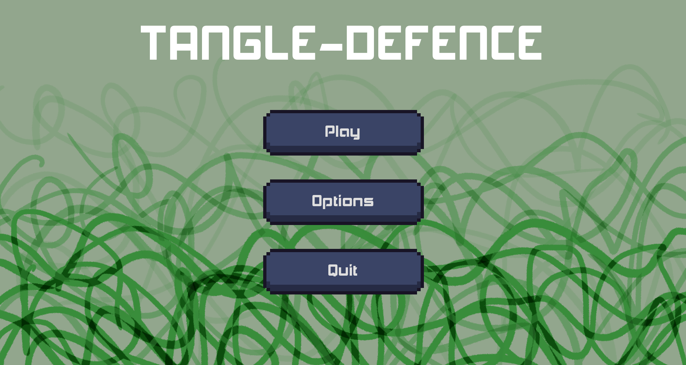
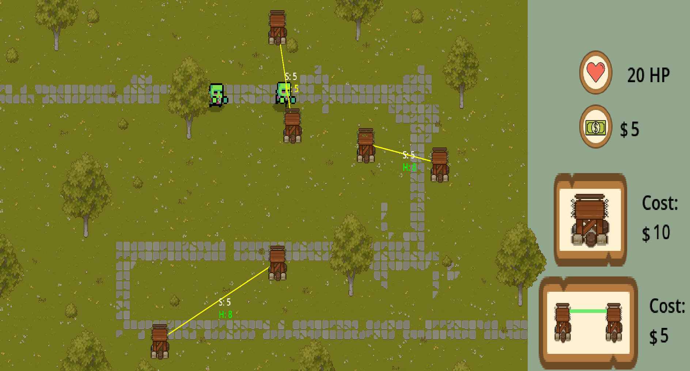
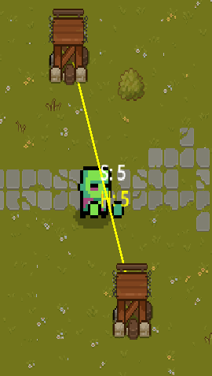
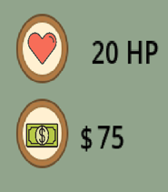

**Nelson, BC – Summer 2025 Game Jam Entry**  
**Development Time:** 48 Hours  
**Authors:**  
- Mathew Terhune – [GitHub](https://github.com/mathewterhune) | [LinkedIn](https://www.linkedin.com/in/mathew-terhune-b07749235/) | [Website](https://mathewterhune.me/) 
- Brent Machado – [GitHub](https://github.com/your-username) | [LinkedIn](https://linkedin.com/in/your-profile) | [Website](https://yourwebsite.com)

---



---



---

Tangle Defense is a strategy game created for the **2025 Summer Game Jam** under the theme **"Tangle"**.  
Inspired by *Bloons Tower Defense*, the game challenges players to build spatial defenses using rope connections to stop enemy waves.

This prototype features:
- A functioning health and money system
- A dynamic wave system
- Interactive UI
- Parallax background visuals
- Node placement and rope mechanics
- One full level with game over and victory screens

> ⚠️ **DISCLAIMER:** This game currently contains only one level. It is a prototype built under strict time constraints.

---

## 🧠 Game Concept

Enemies follow a pre-defined path. Your job is to stop them by placing towers and connecting them with ropes. Ropes weaken the more they intersect — so place carefully!

The **left side** of the screen shows:
- Health
- Money

The **right side** has a tower placement button. Place two towers and connect them to form a rope that will damage enemies.

---

## 🧮 Resource Management

- **Starting Money:** $100  
- **Node Cost:** $10  
- **Rope Cost:** $5  
- **Enemy Kill Reward:** $5  

If an enemy is killed by a rope, you gain $5 back.


---

## 💥 Combat System

- Ropes automatically damage enemies that pass through them
- Rope strength decreases the more they intersect with other ropes
- Ropes are destroyed if they lose all their health
- Enemy collisions reduce rope health and trigger damage



---

## ❤️ Health System

- You begin with **10 health**
- Each enemy reaching the goal reduces your health by their **strength**
- When health drops to 0 or below, it’s game over



---

## ⚔️ Waves & Difficulty

- The game has **5 waves**
- Each wave increases in enemy count (1, 2, 3, 4, 5...)
- Enemies grow stronger as the game progresses

---

## 🎮 How to Play

### Goal
- Defend the end of the enemy path using rope-connected towers
- Survive all 5 waves

### Gameplay
- Click the “+” icon to enter placement mode
- Place towers on the grid ($10 each)
- Select two placed towers to connect them with a rope ($5)
- Ropes damage enemies that touch them
- Intersecting ropes are weaker

### Money
- Start with $100
- Earn $5 for each enemy destroyed
- Spend wisely to keep building and defending

### Health
- Start with 10 health
- Enemies reduce your health based on their strength
- If health hits 0, the game ends

### Monster Strength
- Stronger enemies appear each wave
- Enemy strength determines:
  - Damage to the player’s health
  - Damage dealt to ropes

---

## 📁 Project Structure

```text
scenes/
├── game.tscn         # Main game scene
├── UI.tscn           # Main menu
├── HowToPlay.tscn    # Instructions screen
├── GameOver.tscn     # Game over screen
├── player_win.tscn   # Victory screen

scripts/
├── main.gd           # Core game logic
├── Enemy.gd          # Enemy behavior and rope collision
├── Edge.gd           # Rope connection behavior
├── Node.gd           # Handles node placement and selection
├── sprite_2d.gd      # Sprite control logic
├── game_over.gd      # Game over screen handling
├── player_win.gd     # Victory screen behavior
```
